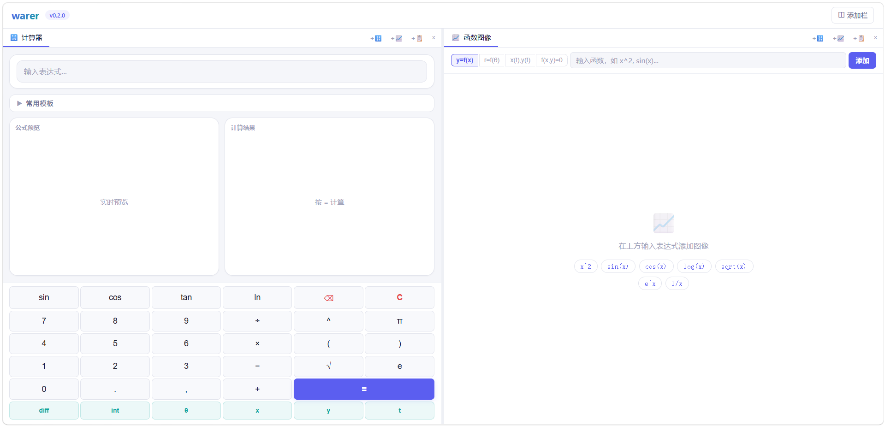
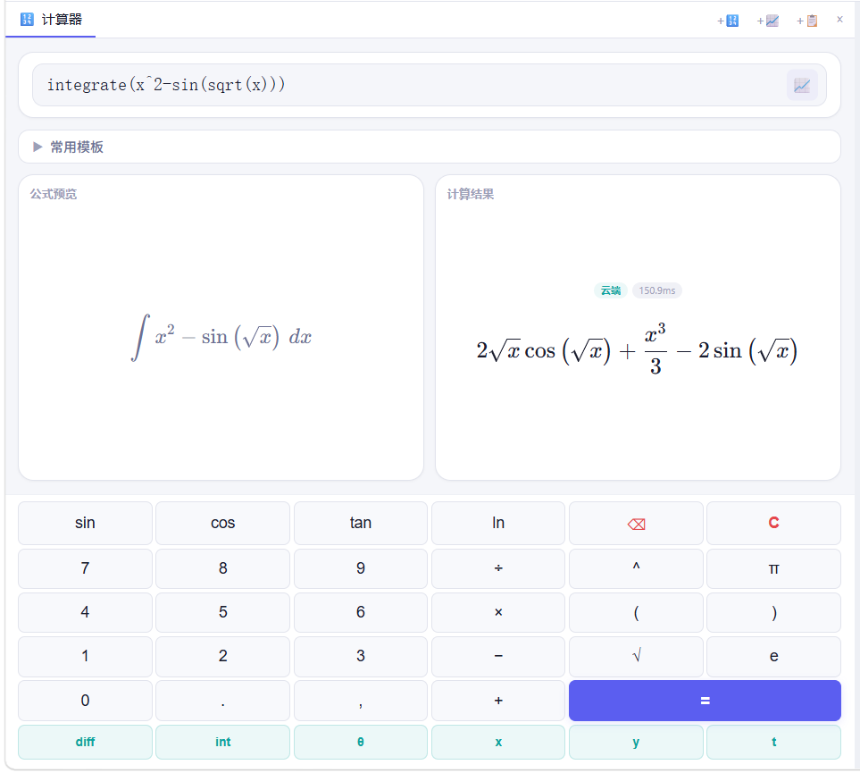
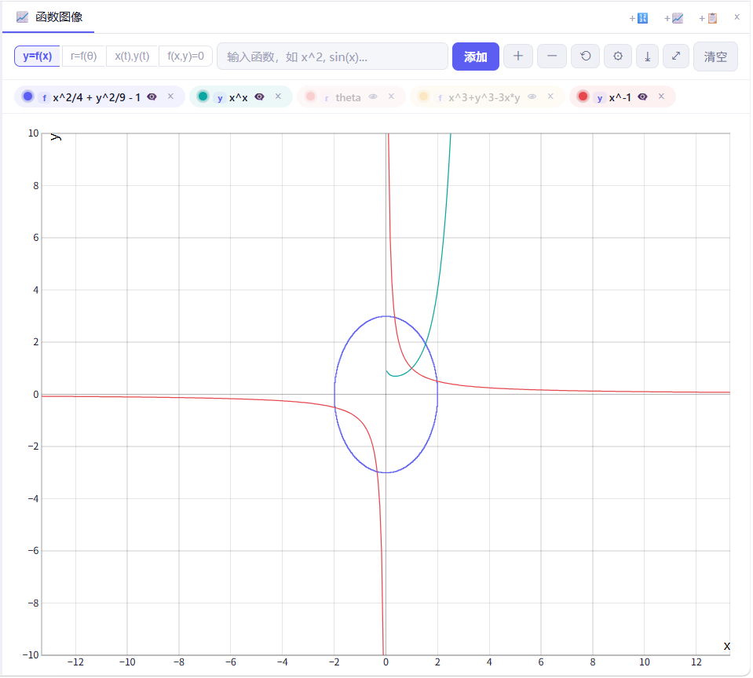

# Warer Web

Warer 追求轻量直觉的操作体验，采用"离线基础运算 + 云端符号引擎"的混合架构，支持公式可视化。

---

## 🌐 项目导航

| 项目            | 仓库地址                                                      | 状态     |
| :------------ | :-------------------------------------------------------- | :----- |
| **主仓库**       | [warer](https://github.com/wwwaker/warer)                 | ✅ 活跃   |
| **Web 前端**    | [warer-web](https://github.com/wwwaker/warer-web)         | ✅ 活跃   |
| **Android 端** | [warer-android](https://github.com/wwwaker/warer-android) | 🔄 待实现 |

---

## 📷 功能预览



### 计算器界面


### 函数图像


---

## ✨ 已实现功能

### 🧮 计算器核心功能
- **数学表达式计算**：支持基本算术、三角函数、对数、指数等运算
- **公式实时预览**：使用 KaTeX 渲染数学公式，输入即所见
- **智能括号补全**：自动检测括号匹配，提供补全提示
- **双引擎计算**：本地 Math.js + 云端 SymPy，自动选择最优方案
- **常用模板面板**：求根、求导、积分、化简等预设模板

### 📈 函数图像功能
- **四种函数模式**：
  - 线性函数 `y = f(x)`
  - 极坐标函数 `r = f(θ)`
  - 参数方程 `x(t), y(t)`
  - 隐函数 `f(x, y) = 0`
- **交互操作**：鼠标拖拽平移、滚轮缩放
- **函数管理**：多函数同时绘制，颜色自定义、显示/隐藏切换
- **图像导出**：支持导出图片

### 📋 历史记录功能
- **分类浏览**：按计算、绘图类型筛选
- **关键词搜索**：支持搜索历史记录
- **日期分组**：自动按日期分组显示
- **历史回溯**：点击历史记录可重新计算或绘图

### 🎨 多栏卡片系统
- **多栏布局**：支持最多 3 栏并行工作
- **卡片管理**：添加/删除计算器、图像、历史卡片
- **拖拽排序**：支持卡片在栏间拖拽移动
- **列宽调整**：支持拖拽调整列宽度

---

## 🚀 快速开始

### 1. 安装依赖

```bash
npm install
```

### 2. 启动开发服务器

```bash
npm run dev
```

浏览器访问终端输出的地址（默认 `http://localhost:5173`）。

### 3. 构建生产版本

```bash
npm run build
```

产物输出到 `dist/` 目录。

### 4. 预览生产构建

```bash
npm run preview
```

---

## 🔧 技术栈

| 模块 | 技术选型 | 关键库 |
| :--- | :--- | :--- |
| 框架 | React 19 + TypeScript | React 19, TypeScript |
| 构建工具 | Vite 8 | Vite |
| 本地计算 | Math.js | mathjs |
| 公式渲染 | KaTeX | katex |
| 函数图像 | function-plot | function-plot |
| 状态管理 | Zustand | zustand |

---

## 📁 项目结构

```
src/
├── components/        # UI 组件
│   ├── CalculatorTab  # 计算器主界面
│   ├── GraphTab       # 函数图像
│   ├── HistoryTab     # 历史记录
│   ├── Keyboard       # 科学键盘
│   └── KatexRenderer  # KaTeX 渲染器
├── engine/            # 计算引擎
│   ├── localEngine    # 离线计算（Math.js）
│   ├── cloudEngine    # 云端计算（API 调用）
│   ├── dispatcher     # 本地/云端决策路由
│   └── latexPreview   # 输入→LaTeX 转换
├── store/             # Zustand 状态管理
└── App.tsx            # 应用入口
```

---

## 🔗 连接后端

默认后端地址为 `http://localhost:8000`。如需修改，编辑 `src/engine/cloudEngine.ts` 中的 `API_BASE` 常量。

## 📝 待实现功能

### 功能扩展
- [ ] **矩阵运算**：支持矩阵的创建、运算和求逆
- [ ] **统计功能**：支持均值、方差、标准差等统计计算
- [ ] **单位换算器**：长度、重量、温度等单位转换
- [ ] **`nsolve` 数值求根**：无解析解方程的数值解法
- [ ] **关键点标注**：自动计算并标注零点、极值点、交点
- [ ] **数据导出**：将图像数据导出为 CSV 格式

### UI/UX 交互体验优化
- [ ] **快捷键支持**：丰富的键盘快捷键操作
- [ ] **帮助页面**：提供功能指导
- [ ] **动态错误高亮**：在输入框中标记出错字符位置
- [ ] **智能补全提示**：输入函数时自动显示模板
- [ ] **移动端优化**：更好的移动端触控体验

### 个性化设置
- [ ] **主题切换**：深色模式和浅色模式
- [ ] **历史记录**：保持历史记录到本地
- [ ] **精度控制**：调整数值计算的保留小数位数

---

## 📜 设计理念

**精准、锋利、一触即发**

- **简洁小巧**：不追求大而全，专注于核心计算需求
- **上手容易**：直观的操作方式，无需学习成本
- **跨平台**：Web、Android 多端一致体验
- **离线优先**：基础运算无需网络，确保随时可用

---
